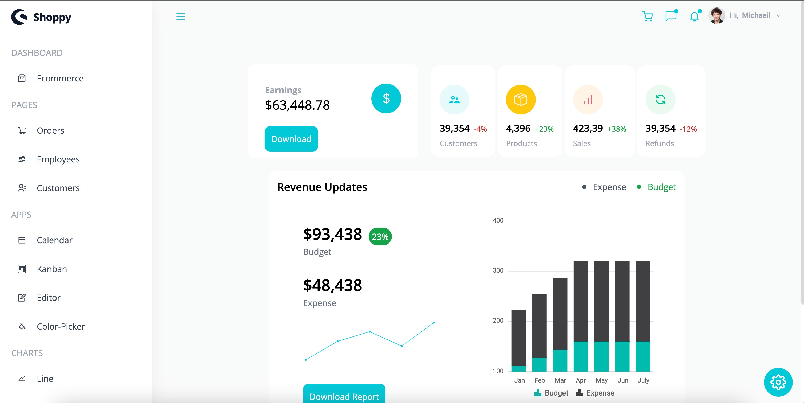

# Syncfusion React Admin Dashboard

A responsive and feature-rich admin dashboard built with React and Syncfusion components. The dashboard includes theming options, tables, charts, calendar, and a kanban dropdown. Tailwind CSS is used for styling to ensure full responsiveness.

 

## Technologies Used

- **Syncfusion**: UI components for React applications.
- **Tailwind CSS**: A utility-first CSS framework.

## Features

- **Theming:** Customize the dashboard theme to suit your preferences.
- **Tables:** Manage and display data in a tabular format.
- **Charts:** Visualize data with interactive charts.
- **Calendar:** Plan and organize events using a calendar.
- **Kanban Dropdown:** Implement a dropdown with kanban functionality.
